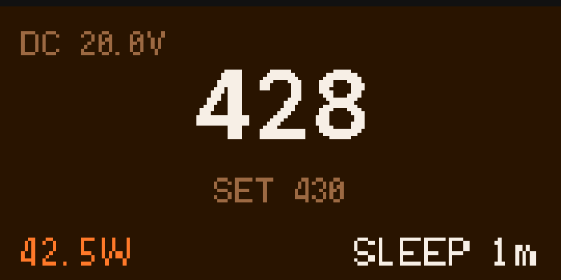

[](https://github.com/ok2cm/IronOS)
[](https://github.com/ok2cm/IronOS/releases/latest)

# IronOS - FNIRSI HS-02 fork

This repository provides [FNIRSI HS-02](https://www.fnirsi.com/products/hs-02) iron support.

## HS-02 Color UI

The HS-02 home, soldering, boost, and sleep pages use a four-colour interface.



The preview is rendered from the production drawing code through WebAssembly:

```bash
source /path/to/emsdk/emsdk_env.sh
tools/hs02-wasm-preview/build.sh
python3 -m http.server 18080 --directory tools/hs02-wasm-preview
```

Open `http://127.0.0.1:18080/web/` and select idle, solder, boost, or sleep.

It is a fork of following projects:
* [Ralim - IronOS](https://github.com/Ralim/IronOS)
* [PanKleszcz - IronOS](https://github.com/PanKleszcz/IronOS)
* [ok2cm - IronOS](https://github.com/ok2cm/IronOS)

## Key Features

- Aggresive PID controller , better heat power than stock firmware.
- Full screen LCD support (Main Screen is colored now).
- Accelerometer support.
- Status LED support.
- Buzzer support; however, disabled in default releases because it is too annoying.
- Stock Boot logo added.

## Missing features & limitations

- Tip resistance detection and short circuit protection.
- PD required voltage selection.
- Translations in CJK won't works, others in theory is fine, but I don't recommend.

## Supported Hardware

|     Device     | DC  | QC  | PD   |        Notes                  |
| :------------: | :-: | :-: | :--: | :---------------------------: |
| FNIRSI HS-02A  | ✔️  | ❌  | ✔️\* |                               |
| FNIRSI HS-02B  | ✔️  | ❌  | ✔️\* | Not tested                    |
| \*\*           |     |     |      |                               |

\* _HS-02_ has CH224K PD controller which provides no negotiation feedback to the HS02A CPU (as far as I know). Requested voltage is fixed to 20V in this release. 
\*\* [Original IronOS](https://github.com/Ralim/IronOS) HW ports are preserved but they are _not tested and may be broken!_

## Installation

1. Hold _OK button_ and connect HS-02 to PC using USB cable.
2. Release the button when _"Please drag the firmware file to the USB flash disk!"_ message is displayed.
3. Wait until HS02 bootloader is detected as FAT mass storage device named _BOOTLOADER_ having an empty file _READY.TXT_ insde.
4. Copy _HS02_xx_firmware.bin_ file on the _BOOTLOADER_ device.
    1. On Linux, it is required to copy (replace) the file one more time for some reason.
    2. There is a timeout (≈ 40 seconds) to start the upload. If expired, the bootloader is terminated and current firmware is launched.
5. _"Updating firmware!"_ message is displayed and the device is rebooted into the new firmware.

## Builds

The links in the table below allow to download available builds directly:

|        Device         | Stable Release |
|:---------------------:|:--------------:|
| FNIRSI HS-02          | [HS02.zip](https://github.com/ok2cm/IronOS/releases/download/v1.00/HS02.zip) |

[^changelog]:

## Getting Started

To get started with _IronOS firmware_, please jump to [Getting Started Guide](https://ralim.github.io/IronOS/GettingStarted/) (original IronOS documentation).

## Basic Control

Supported device is controlled by two buttons which can be pressed in the following ways:
 - short: ~1 second or so;
 - long: more than 1 second;
 - both (press & hold both of them together).

Available buttons are:
 - `+/A` button: near the front closer to the tip (for irons) or on the left side of the device (for plates);
 - `-/B` button: near the back far from the tip (for irons) or on the right side of the device (for plates).

After powering on the device for the first time with _IronOS_ installed and having the tip/plate plugged in, on the main menu in _standby mode_ the unit shows a pair of prompts for the two most common operations:
- pressing the `+/A` button enters the _soldering mode_;
- pressing the `-/B` button enters the _settings menu_;
- in _soldering mode_:
  - short press of `+/A` / `-/B` buttons changes the soldering temperature;
  - long press of the `+/A` button enables _boost mode_ (increasing soldering temperature to the adjustable setting as long as the button is pressed);
  - long press of the `-/B` button enters _standby mode_ and stops heating;
- in _standby mode_:
  - long press of the `+/A` button enters _soldering temperature adjust mode_ (the same as the one in the _soldering mode_, but allows to adjust the temperature before heating up);
  - long hold of the `-/B` button enters the [_debug menu_](https://ralim.github.io/IronOS/DebugMenu/);
- in _menu mode_ (to make it short here):
  - `-/B` scrolls & cycles through menus and submenus;
  - `+/A` enters to menu & submenu settings or changes their values if they are activated already.

Additional details are described in the [menu information](https://ralim.github.io/IronOS/Menu/).

## License

The code created by the community is covered by the [GNU GPLv3](https://www.gnu.org/licenses/gpl-3.0.html#license-text) license **unless noted elsewhere**.
Other components such as _FreeRTOS_ and _USB-PD_ have their own licenses.

## Commercial Use

This software is provided _**"AS IS"**_, so I cannot provide any commercial support for the firmware.
However, you are more than welcome to distribute links to the firmware or provide hardware with this firmware.
**Please do not re-host the files, but rather link to this page, so that there are no old versions of the firmware scattered around**.
